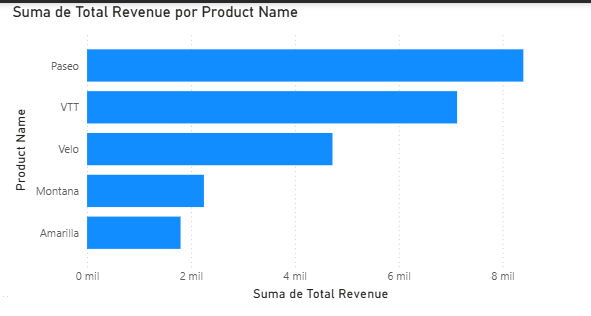
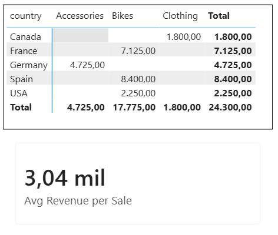
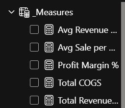
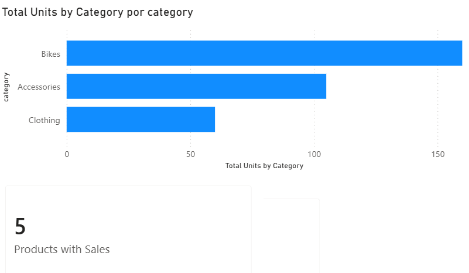
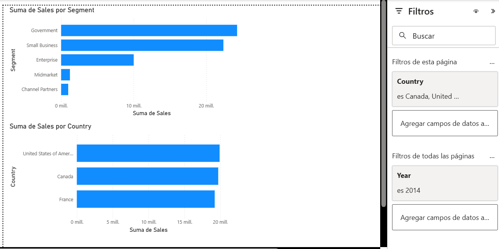

# Power BI – Enterprise Data Analytics Portfolio

**Ana Ballock** · [LinkedIn](https://linkedin.com/in/anaballock) · [GitHub](https://github.com/apballock)

---

Enterprise-style Power BI analytics project built on top of a relational MySQL database, covering the full BI workflow: ETL, data modeling, DAX calculations, semantic layer organization, and analytical storytelling.

---

## Tech Stack

Power BI Desktop · MySQL · DAX · Power Query M · MySQL Connector/NET

---

## Model Overview

- 2 relational tables
- 1 Calendar dimension
- 10+ DAX measures
- Live MySQL database connection
- Time intelligence enabled
- Multi-level filter architecture
- Centralized semantic layer organization

---

## Project Structure

```text
├── Level 1 – Connectors & Power Query
│   ├── MySQL Integration
│   ├── Custom Column Transformations
│   └── Calendar Table (DAX)
├── Level 2 – Advanced DAX
│   ├── RELATED() for cross-table lookups
│   ├── SUMX / AVERAGEX iterator functions
│   └── Centralized Measures Table
└── Level 3 – Filters & CROSSFILTER
    ├── CROSSFILTER for bidirectional filtering
    └── Visual / Page / Report level filters
```

---

## Architecture Flow

```text
MySQL Database
       ↓
Power Query (ETL & Cleaning)
       ↓
Data Model & Relationships
       ↓
DAX Measures & Calculations
       ↓
Interactive Power BI Dashboard
```

---

# Level 1 – Connectors & Power Query

## MySQL Integration

Connected Power BI directly to a local MySQL database (`sales_db`) containing two relational tables — `products` and `sales` — replacing static flat files with a live relational source. Configured the MySQL Connector/NET dependency and validated end-to-end connectivity between MySQL and Power BI Desktop.

### Outcome

Both tables loaded successfully into the Data View with a stable connection, establishing the foundation for all subsequent modeling work.


---

## Custom Column via Power Query

Built a revenue classification column in Power Query M using conditional logic, categorizing transactions into High / Medium / Low tiers based on sales thresholds.

During data profiling, identified a silent data quality issue — a leading whitespace in a column name that was breaking downstream transformations — and resolved it before applying the business logic.

### Business Insight

The dataset exhibits a polarized revenue structure with strong concentration at the high end and notable low-value volume, suggesting an opportunity to develop mid-market positioning.


---

## Calendar Table (DAX)

Designed a dedicated Calendar Table using DAX `CALENDAR()` and `ADDCOLUMNS()` functions, spanning 2013–2014 and including Year, Month, Quarter, and Day of Week attributes.

Established a relationship between `Calendar[Date]` and `financials[Date]` to enable time intelligence across the model. Configured `MonthName` to sort by `MonthNumber` to ensure correct chronological rendering in visuals.

```dax
Calendar =
ADDCOLUMNS(
    CALENDAR(DATE(2013,1,1), DATE(2014,12,31)),
    "Year",        YEAR([Date]),
    "MonthNumber", MONTH([Date]),
    "MonthName",   FORMAT([Date], "MMMM"),
    "Quarter",     "Q" & FORMAT(QUARTER([Date]), "0"),
    "DayOfWeek",   FORMAT([Date], "dddd")
)
```

### Why It Matters

A dedicated Calendar Table is essential in professional Power BI models. It enables accurate time intelligence calculations (YoY, rolling averages, period comparisons) while ensuring filter consistency across the semantic model.


---

# Level 2 – Advanced DAX

## RELATED() – Cross-Table Lookup

Used `RELATED()` to enrich the `sales` fact table with product attributes from the `products` dimension table, avoiding data duplication and preserving a normalized model structure.

Built three calculated columns — Product Name, Unit Price, and Total Revenue — by traversing the established relationship.

```dax
Product Name =
RELATED('sales_db products'[product_name])

Unit Price =
RELATED('sales_db products'[unit_price])

Total Revenue =
'sales_db sales'[units_sold] * 'sales_db sales'[Unit Price]
```

### Business Insight

*Paseo* emerged as the top revenue-generating product, combining competitive unit pricing with high transaction volume.



---

## SUMX / AVERAGEX – Iterator Functions

Implemented row-level revenue calculations using `SUMX()` and `AVERAGEX()`, combining the `sales` and `products` tables through `RELATED()`.

This approach becomes necessary when calculation operands reside in different tables — a scenario where a simple `SUM()` is insufficient.

```dax
Total Revenue SUMX =
SUMX(
    'sales_db sales',
    'sales_db sales'[units_sold] *
    RELATED('sales_db products'[unit_price])
)

Avg Revenue per Sale =
AVERAGEX(
    'sales_db sales',
    'sales_db sales'[units_sold] *
    RELATED('sales_db products'[unit_price])
)
```

Built a Matrix visual breaking down revenue by Country × Category, with a KPI card displaying an Average Revenue per Sale of **3.04K**.

The highest-performing combination was **Spain + Bikes**, driven by both unit price and transaction volume.



---

## Centralized Measures Table

Organized all DAX measures into a dedicated `_Measures` table (prefixed with an underscore to pin it to the top of the Data pane).

Hidden the auxiliary `Info` column and migrated all analytical measures — including revenue, margin, COGS, and CROSSFILTER measures — into a centralized semantic layer.

### Why It Matters

In enterprise BI environments, scattered measures across multiple tables create maintenance overhead, governance challenges, and onboarding friction.

A centralized Measures table is considered a best practice for scalable semantic model management.



---

# Level 3 – Filters & CROSSFILTER

## CROSSFILTER – Dynamic Relationship Direction

Applied `CROSSFILTER()` inside `CALCULATE()` to temporarily override the default single-direction filter propagation between `sales` and `products`.

This enabled counting active products based on sales activity — a calculation that the default model topology cannot support without bidirectional filtering.

```dax
Products with Sales =
CALCULATE(
    COUNTROWS('sales_db products'),
    CROSSFILTER(
        'sales_db sales'[product_id],
        'sales_db products'[product_id],
        BOTH
    )
)
```

### Business Insight

All five products in the catalog registered sales activity, indicating no inactive inventory. Bikes led total unit sales, confirming its role as the primary volume driver.



---

## Visual, Page & Report Level Filters

Demonstrated layered filter architecture across Power BI’s three filtering scopes.

| Scope | Configuration | Effect |
|---|---|---|
| Visual Filter | Sales > 500,000 | Isolated top-performing segments in a single visual |
| Page Filter | Country ∈ {USA, Canada, France} | Applied regional scope to all visuals on the page |
| Report Filter | Year = 2014 | Propagated a global time constraint across all report pages |

### Why It Matters

This filter hierarchy is central to enterprise dashboard design, enabling analysts to maintain global consistency while preserving flexibility for localized storytelling and analysis.



---

# Key Takeaways

- End-to-end analytics pipeline from relational database to analytical reporting
- Direct MySQL integration with no intermediate flat files
- Data quality issues identified and resolved during the ETL phase
- Normalized semantic model with dedicated Calendar and Measures tables
- Advanced DAX patterns applied to realistic business scenarios
- Enterprise-oriented filter governance strategy across multiple report scopes
- Business storytelling integrated into technical implementation
___________________________________________________________________________________________________
