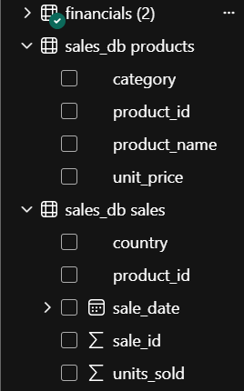
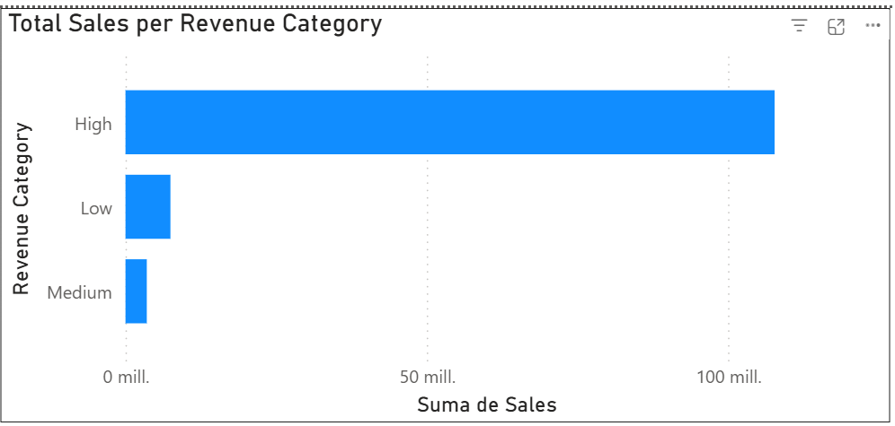
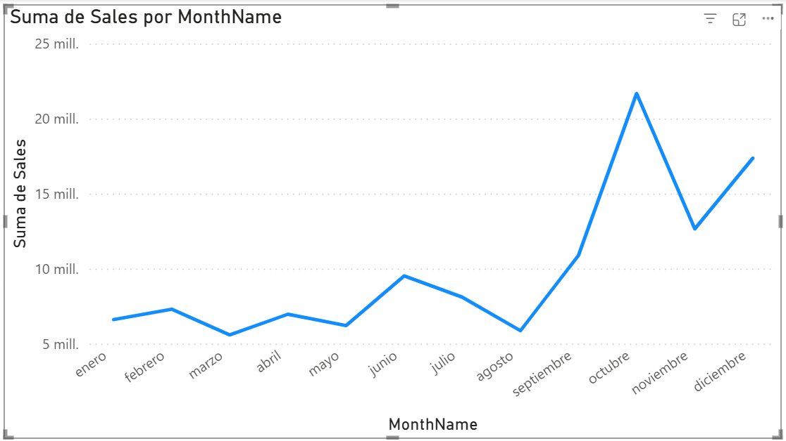

## Level 1 – Connectors & Power Query Transformations  
### Exercise 1 – Connect Power BI to MySQL

### Objective

Connect :contentReference[oaicite:0]{index=0} to a MySQL database to simulate a real-world enterprise data source (instead of flat files).

---

## Database Setup (MySQL)

A local database named **sales_db** was created in MySQL with two tables:

- `products`
- `sales`

After executing the SQL script successfully, the dataset contained:

### Tables Loaded:
- **products → 5 rows**
- **sales → 8 rows**

---

## Power BI Connection Process

The connection was established using:

- Server: `localhost`
- Database: `sales_db`
- Authentication: MySQL root credentials

### 🔧 Issue Encountered

During the connection process, Power BI required an additional component:

> “This connector requires additional components to be installed”

### Solution Applied

The missing dependency was resolved by installing:

- MySQL Connector/NET from official MySQL site

After installation and restarting Power BI, the connection worked successfully.

---

## Result

Both tables were successfully loaded into Power BI:

- products
- sales

The tables became available in the **Data View**, confirming a successful live connection to the MySQL database.

---

## Key Takeaway

This exercise demonstrates a fundamental real-world data workflow:

> Instead of static files, analysts often connect BI tools directly to relational databases.

Understanding how to resolve connector dependencies is essential when working in enterprise environments.

---

## Screenshot

### MySQL Connection in Power BI

---

## Exercise 2 – Custom Column in Power Query

### Objective

Create a calculated column in Power Query to classify revenue into business categories, simulating a real ETL transformation step before data modeling.

---

## Transformation Process

A custom column was created in Power Query using the Financial Sample dataset.

### Column Created:
- Revenue Category

### Logic Applied:

Revenue Category logic:
- If Sales > 100000 → "High"
- If Sales > 50000 → "Medium"
- Else → "Low"

---

## Data Quality Issue Encountered

### Issue Identified

A hidden data quality problem was found:

- The column name had a leading whitespace:
  - " Sales" instead of "Sales"

### Impact

This caused:
- Errors in the custom column formula
- Power Query failing to recognize the column correctly

---

## Solution Applied

The issue was resolved by:

- Removing whitespace from the column name
- Reapplying the custom column logic

After correction, the transformation worked successfully.

---

## Visualization Created

A bar chart was built using:

- X-Axis: Revenue Category
- Y-Axis: Sales
- Sorted in descending order

---

## Business Insight

### Revenue Distribution

- High category has the largest share of sales
- Low category is second
- Medium category has the smallest share

### Interpretation

The dataset shows a **polarized revenue structure**:
- Strong concentration in high-value transactions
- Significant low-value volume
- Weak mid-range activity

This may indicate:
- Strong premium customer base
- Opportunity to improve mid-market sales strategy

---

## Key Takeaway

Power Query plays a critical role in data preparation before analysis.

Small data quality issues (like hidden spaces in column names) can break transformations and must be identified early in the ETL process.

---

## Screenshot

---

## Exercise 3 – Create a Calendar Table with DAX

### Objective

Build a dedicated Calendar Table using DAX to enable proper time intelligence analysis in Power BI.

This is a foundational step in professional data modeling.

---

## Calendar Table Creation

A Calendar Table was created using DAX:

Calendar table logic:
- Date range: 2013–2014
- Includes Year, Month, Quarter, and Day of Week attributes

---

### DAX Formula Used

Calendar =
ADDCOLUMNS(
    CALENDAR(DATE(2013,1,1), DATE(2014,12,31)),
    "Year", YEAR([Date]),
    "MonthNumber", MONTH([Date]),
    "MonthName", FORMAT([Date], "MMMM"),
    "Quarter", "Q" & FORMAT(QUARTER([Date]), "0"),
    "DayOfWeek", FORMAT([Date], "DDDD")
)

---

## Data Model Relationship

A relationship was created between:

- Calendar[Date] → financials[Date]

This enables proper time-based filtering and analysis across the model.

---

## Data Modeling Issue Encountered

### Problem

Initial issues occurred with month sorting:
- Months were displayed in alphabetical order
- Time series visuals were not chronological

### Root Cause

- MonthName is text-based
- Incorrect or missing sort configuration

---

## Solution Applied

The issue was fixed by:

- Ensuring MonthNumber is numeric
- Sorting MonthName by MonthNumber
- Rebuilding Calendar structure with consistent naming

This restored correct chronological ordering.

---

## Validation Test

A line chart was created:

- X-Axis: Calendar[MonthName]
- Y-Axis: Sales

### Result:
- Months displayed correctly from January to December
- Time intelligence structure validated successfully

---

## Business Insight

### Why Calendar Tables Matter

A dedicated Calendar Table is essential because it:

- Enables accurate time intelligence calculations
- Ensures correct filtering across time periods
- Supports advanced DAX functions (YoY, moving averages, etc.)

Without it, time-based analysis becomes unreliable.

---

## Key Takeaway

A strong data model is the foundation of good analytics.

The Calendar Table is not optional in professional Power BI projects — it is a core requirement for time-based analysis.

---

## Screenshot

